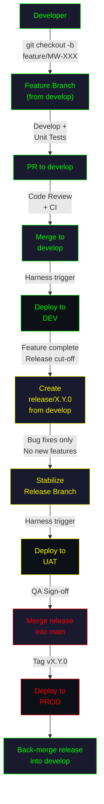
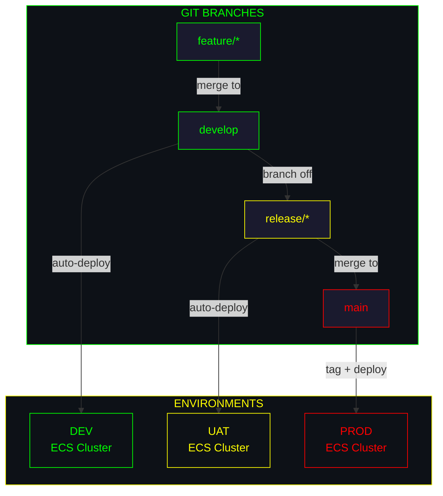
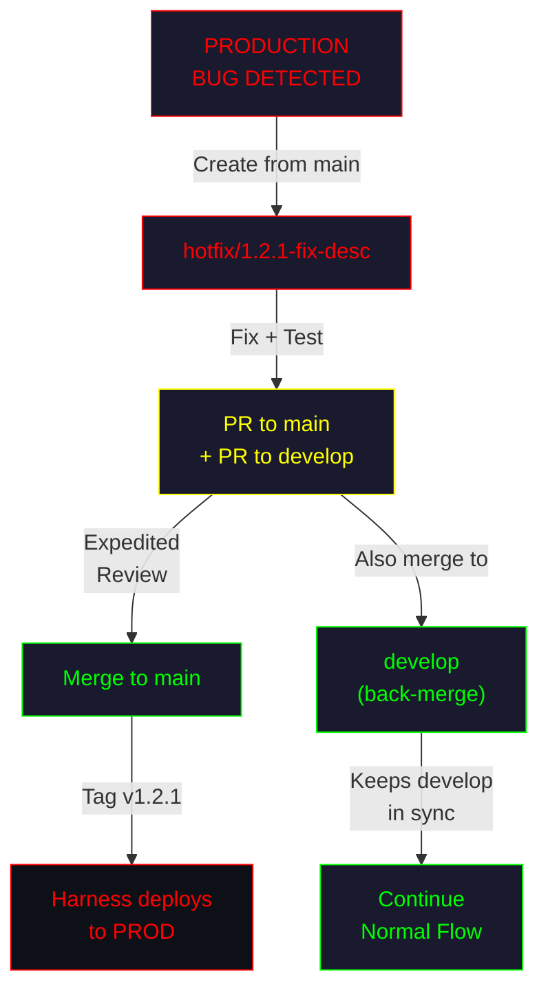
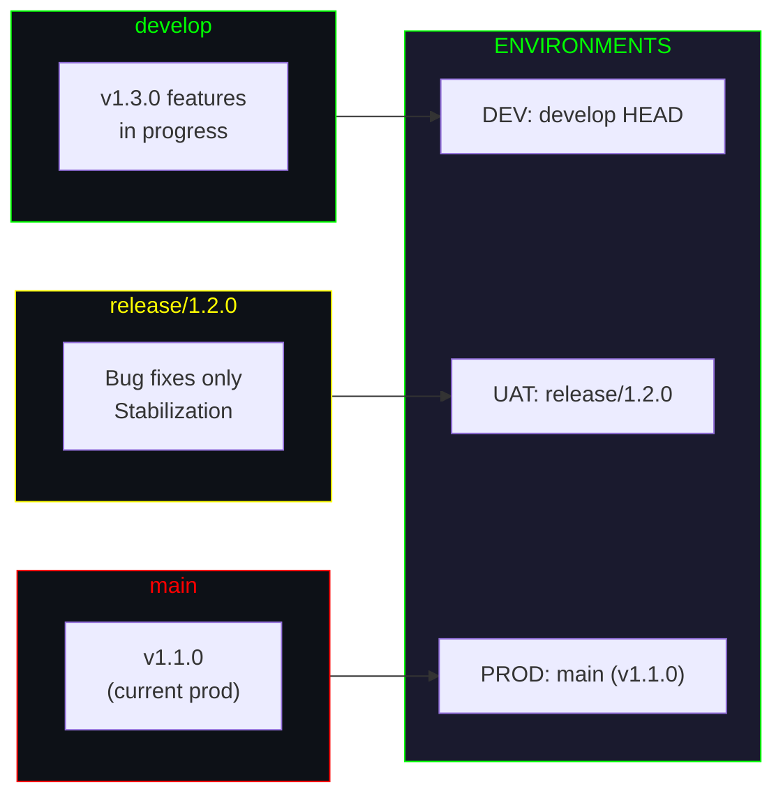

# ╔══════════════════════════════════════════════════════════════════╗
# ║        GITFLOW — MULTI-LEVEL FEATURE BRANCHING                 ║
# ║        Java Middleware | GitHub + Harness + AWS ECS             ║
# ╚══════════════════════════════════════════════════════════════════╝

```
┌─────────────────────────────────────────────────────────────────┐
│  STRATEGY: GITFLOW                                              │
│  ─────────────────────────────────────────────────────────────  │
│  Philosophy: Structured, multi-branch release management.       │
│  Core Branches: main (production), develop (integration)        │
│  Supporting: feature/*, release/*, hotfix/*                     │
│  Deployment: Scheduled releases with defined cut-off dates.     │
└─────────────────────────────────────────────────────────────────┘
```

---

## Table of Contents

- [Branch Structure](#branch-structure)
- [Visual Flow Diagram](#visual-flow-diagram)
- [Workflow Steps](#workflow-steps)
- [Environment Mapping](#environment-mapping)
- [Harness Pipeline Configuration](#harness-pipeline-configuration)
- [Hotfix Protocol](#hotfix-protocol)
- [Simultaneous Releases](#simultaneous-releases)
- [Pros and Cons](#pros-and-cons)

---

## Branch Structure

```
┌─────────────────────────────────────────────────────────────────┐
│  BRANCH TOPOLOGY                                                │
│  ─────────────────────────────────────────────────────────────  │
│                                                                 │
│  main ────●──────────────────────●──────────●────────►         │
│            \                    / \        / \                   │
│  hotfix/    \                  /   ●──────●   \                 │
│              \                /                 \                │
│  release/     \        ●────●                   \              │
│                \      /      \                   \             │
│  develop ───────●────●────●───●────●────●────●───●────►       │
│                  \  /  \  /         \  /                        │
│  feature/         ●     ●           ●     (days to weeks)      │
│                                                                 │
└─────────────────────────────────────────────────────────────────┘
```

**Long-lived branches:**
- **`main`** — Always mirrors what is in production. Tagged with version numbers.
- **`develop`** — Integration branch. All feature work merges here first.

**Short-lived branches:**
- **`feature/*`** — Individual features, branched from `develop`.
- **`release/*`** — Release stabilization, branched from `develop`.
- **`hotfix/*`** — Emergency fixes, branched from `main`.

---

## Visual Flow Diagram

### Full GitFlow Lifecycle

```mermaid
gitgraph
    commit id: "init" tag: "v1.0.0"
    branch develop
    commit id: "dev-setup"

    branch feature/MW-101-auth
    commit id: "auth-filter"
    commit id: "auth-tests"
    checkout develop
    merge feature/MW-101-auth id: "merge-101"

    branch feature/MW-102-cache
    commit id: "redis-cache"
    commit id: "cache-tests"
    checkout develop
    merge feature/MW-102-cache id: "merge-102"

    branch release/1.1.0
    commit id: "bump-version"
    commit id: "fix-typo"
    checkout main
    merge release/1.1.0 id: "release-1.1.0" tag: "v1.1.0"
    checkout develop
    merge release/1.1.0 id: "back-merge-release"

    checkout main
    branch hotfix/1.1.1-npe
    commit id: "fix-npe"
    checkout main
    merge hotfix/1.1.1-npe id: "hotfix-1.1.1" tag: "v1.1.1" type: REVERSE
    checkout develop
    merge hotfix/1.1.1-npe id: "back-merge-hotfix"
```

### Deployment Flow



---

## Workflow Steps

### Phase 1 — Feature Development

```bash
# Start from develop
git checkout develop
git pull origin develop

# Create feature branch
git checkout -b feature/MW-150-add-circuit-breaker

# Develop and test
mvn clean verify

# Commit
git add src/
git commit -m "feat(MW-150): add circuit breaker for payment service"

# Push
git push origin feature/MW-150-add-circuit-breaker
```

Open a **Pull Request** targeting `develop`. After review and CI pass, **merge** (use merge commit, not squash, to preserve feature history).

### Phase 2 — Release Preparation

When all features for the release are merged into `develop`:

```bash
# Create release branch from develop
git checkout develop
git pull origin develop
git checkout -b release/1.2.0

# Bump version in pom.xml
mvn versions:set -DnewVersion=1.2.0
git add pom.xml
git commit -m "chore: bump version to 1.2.0"

# Push release branch
git push origin release/1.2.0
```

**Rules for the release branch:**
- **No new features.** Only bug fixes, documentation, and version bumps.
- Bug fixes on the release branch must be **back-merged to develop**.
- Harness deploys `release/*` branches to **UAT**.

### Phase 3 — Release Finalization

After QA approves in UAT:

```bash
# Merge release into main
git checkout main
git pull origin main
git merge --no-ff release/1.2.0
git tag -a v1.2.0 -m "Release 1.2.0"
git push origin main --tags

# Back-merge into develop
git checkout develop
git pull origin develop
git merge --no-ff release/1.2.0
git push origin develop

# Clean up
git branch -d release/1.2.0
git push origin --delete release/1.2.0
```

Harness triggers **production deployment** on the `main` merge or tag push.

---

## Environment Mapping



| Branch            | Deploys To   | ECR Tag Pattern          | Trigger                      |
|-------------------|--------------|--------------------------|------------------------------|
| `develop`         | **Dev**      | `dev-latest`             | Auto on merge to develop     |
| `release/X.Y.0`  | **UAT**      | `uat-X.Y.0-rc{n}`       | Auto on push to release/*    |
| `main`            | **Prod**     | `prod-X.Y.0`            | Tag push / merge to main     |
| `hotfix/X.Y.Z`   | **Dev + UAT**| `hotfix-X.Y.Z`          | Auto on push to hotfix/*     |

---

## Harness Pipeline Configuration

```
┌─────────────────────────────────────────────────────────────────┐
│  PIPELINE 1: middleware-develop-deploy                          │
│  ─────────────────────────────────────────────────────────────  │
│  Trigger: Push to develop                                      │
│  Stages: Build → Test → Docker → Deploy-Dev → Smoke-Test       │
│  Target: DEV ECS Cluster                                       │
├─────────────────────────────────────────────────────────────────┤
│  PIPELINE 2: middleware-release-deploy                          │
│  ─────────────────────────────────────────────────────────────  │
│  Trigger: Push to release/*                                    │
│  Stages: Build → Test → Docker → Deploy-UAT → QA-Gate          │
│  Target: UAT ECS Cluster                                       │
├─────────────────────────────────────────────────────────────────┤
│  PIPELINE 3: middleware-prod-deploy                             │
│  ─────────────────────────────────────────────────────────────  │
│  Trigger: Tag push (v*) on main                                │
│  Stages: Build → Test → Docker → Approval-Gate → Deploy-Prod   │
│  Target: PROD ECS Cluster                                      │
├─────────────────────────────────────────────────────────────────┤
│  PIPELINE 4: middleware-hotfix-deploy                           │
│  ─────────────────────────────────────────────────────────────  │
│  Trigger: Push to hotfix/*                                     │
│  Stages: Build → Test → Docker → Deploy-Dev → Fast-Track-Prod  │
│  Target: DEV + PROD (with approval gate)                       │
└─────────────────────────────────────────────────────────────────┘
```

---

## Hotfix Protocol

For critical production issues that cannot wait for the next release:



### Hotfix Steps

1. **Branch from main:**
   ```bash
   git checkout main && git pull origin main
   git checkout -b hotfix/1.2.1-fix-memory-leak
   ```

2. **Fix and verify:**
   ```bash
   # Implement fix
   mvn clean verify
   ```

3. **Open TWO pull requests:**
   - PR #1: `hotfix/1.2.1-fix-memory-leak` → `main`
   - PR #2: `hotfix/1.2.1-fix-memory-leak` → `develop`

4. **Merge to main first** (after expedited review):
   ```bash
   git checkout main
   git merge --no-ff hotfix/1.2.1-fix-memory-leak
   git tag -a v1.2.1 -m "Hotfix 1.2.1: fix memory leak in connection pool"
   git push origin main --tags
   ```

5. **Merge to develop** to keep branches synchronized.

6. **If a release branch exists**, also merge the hotfix into `release/*`:
   ```bash
   git checkout release/1.3.0
   git merge --no-ff hotfix/1.2.1-fix-memory-leak
   git push origin release/1.3.0
   ```

7. **Delete the hotfix branch** after all merges are complete.

---

## Simultaneous Releases

GitFlow naturally supports concurrent release management:

### Scenario: v1.2.0 in UAT while v1.3.0 features are in development



### Managing Multiple Releases

```
┌─────────────────────────────────────────────────────────────────┐
│  CONCURRENT RELEASE TIMELINE                                    │
│  ─────────────────────────────────────────────────────────────  │
│                                                                 │
│  Week 1: release/1.2.0 created from develop                   │
│  Week 2: New features continue on develop (targeting v1.3.0)   │
│  Week 3: release/1.2.0 in UAT — bug fixes applied             │
│  Week 4: release/1.2.0 merged to main, tagged v1.2.0          │
│           release/1.3.0 created from develop                   │
│  Week 5: release/1.3.0 in UAT, develop targets v1.4.0         │
│                                                                 │
│  KEY: Bug fixes on release/* must be back-merged to develop    │
└─────────────────────────────────────────────────────────────────┘
```

**Rules for simultaneous releases:**
- Only **one release branch** should be in UAT at a time (unless you have multiple UAT environments).
- Bug fixes on older release branches must be **cherry-picked or merged forward** into newer release branches and `develop`.
- Never merge `develop` into a release branch — only targeted fixes.

---

## Pros and Cons

```
┌─────────────────────────────────────────────────────────────────┐
│  GITFLOW — PROS & CONS                                          │
├─────────────────────────────────────────────────────────────────┤
│  ADVANTAGES                 │  DISADVANTAGES                    │
├─────────────────────────────┼───────────────────────────────────┤
│  Clear release management   │  Complex branch model             │
│  Parallel development       │  Frequent merge conflicts         │
│  Structured release process │  Slower feedback loops            │
│  Good for scheduled releases│  High cognitive overhead          │
│  Explicit prod/dev split    │  Multiple pipelines needed        │
│  Hotfix path is well-defined│  Back-merges are error-prone      │
│  Supports large teams       │  Can become bottleneck at release │
│  Clear audit trail          │  Over-engineered for small teams  │
└─────────────────────────────┴───────────────────────────────────┘
```

| Factor                 | Rating     | Notes                                              |
|------------------------|------------|----------------------------------------------------|
| Setup Complexity       | **High**   | Multiple branch rules, protections, pipelines      |
| Day-to-Day Complexity  | **Medium** | Developers only touch feature/* and develop         |
| CI/CD Requirements     | **High**   | Need separate pipelines per branch type             |
| Team Discipline Needed | **Medium** | Structure enforces workflow                         |
| Concurrent Releases    | **High**   | Native support via release branches                 |
| Hotfix Speed           | **Medium** | Requires multi-branch merges                        |
| Audit Trail            | **Strong** | Clear separation of releases, features, fixes       |

---

## When to Use GitFlow

**Choose this strategy when:**
- You have **scheduled release cycles** (bi-weekly, monthly, quarterly).
- Your team is **medium to large** (10+ developers).
- You need **clear separation** between development and production code.
- Stakeholders require a **formal release process** with sign-offs.
- Multiple teams contribute to the **same middleware service**.

**Avoid this strategy when:**
- You deploy **continuously** (multiple times per day).
- Your team is **small** (< 5 developers) and moves fast.
- You practice **continuous deployment** to production.
- Merge conflicts are already a **significant pain point**.

---

```
╔══════════════════════════════════════════════════════════════════╗
║  END OF GITFLOW GUIDE                                            ║
║  ← Back to README.md for strategy comparison                     ║
╚══════════════════════════════════════════════════════════════════╝
```
