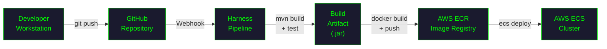
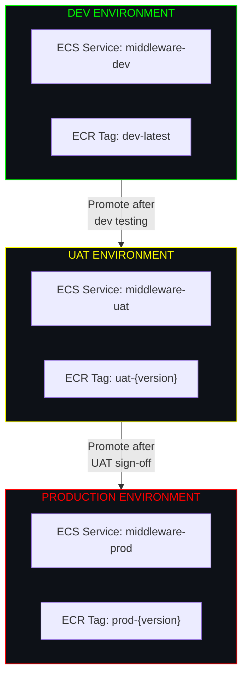

# ╔══════════════════════════════════════════════════════════════════╗
# ║        GIT BRANCHING STRATEGY — CONSOLIDATED OVERVIEW          ║
# ║        Java Middleware Ecosystem | GitHub + Harness + AWS ECS  ║
# ╚══════════════════════════════════════════════════════════════════╝

```
┌─────────────────────────────────────────────────────────────────┐
│  SYSTEM MANIFEST                                                │
│  ─────────────────────────────────────────────────────────────  │
│  VCS .............. GitHub                                      │
│  CI/CD ............ Harness                                     │
│  Registry ......... AWS ECR                                     │
│  Runtime .......... AWS ECS (Fargate / EC2)                     │
│  Language ......... Java (Middleware Services)                   │
│  Environments ..... Dev → UAT → Production                      │
└─────────────────────────────────────────────────────────────────┘
```

---

## Table of Contents

| #  | Strategy              | File                                          | Best For                                    |
|----|-----------------------|-----------------------------------------------|---------------------------------------------|
| 01 | Trunk-Based Dev       | [Trunk-Based.md](./Trunk-Based.md)            | Fast iteration, continuous deployment       |
| 02 | GitFlow               | [GitFlow.md](./GitFlow.md)                    | Structured releases, large teams            |
| 03 | Release Branching     | [Release-Branching.md](./Release-Branching.md)| Simultaneous version management             |

---

## Strategy Comparison Matrix

```
┌────────────────────────┬──────────────┬──────────────┬───────────────────┐
│ CRITERIA               │ TRUNK-BASED  │ GITFLOW      │ RELEASE-BRANCHING │
├────────────────────────┼──────────────┼──────────────┼───────────────────┤
│ Release Cadence        │ Continuous   │ Scheduled    │ Parallel/Scheduled│
│ Branch Complexity      │ Low          │ High         │ Medium            │
│ Merge Conflicts        │ Rare         │ Frequent     │ Moderate          │
│ Hotfix Speed           │ Fast         │ Moderate     │ Fast              │
│ Team Size Fit          │ Small-Medium │ Medium-Large │ Any               │
│ CI/CD Complexity       │ Low          │ High         │ Medium            │
│ Rollback Ease          │ High         │ Medium       │ High              │
│ Concurrent Releases    │ Limited      │ Supported    │ Native            │
│ Learning Curve         │ Low          │ High         │ Medium            │
└────────────────────────┴──────────────┴──────────────┴───────────────────┘
```

---

## Deployment Pipeline — All Strategies

All three strategies share the same underlying deployment infrastructure. The path from **code commit** to **production container** is identical.



---

## Environment Architecture



| Environment | Trigger                        | ECR Tag Pattern       | ECS Cluster         |
|-------------|--------------------------------|-----------------------|---------------------|
| **Dev**     | Push to dev / feature merge    | `dev-latest`          | `ecs-cluster-dev`   |
| **UAT**     | Promotion from Dev             | `uat-{version}-rc{n}` | `ecs-cluster-uat`   |
| **Prod**    | Manual approval / tag push     | `prod-{version}`      | `ecs-cluster-prod`  |

---

## Harness Pipeline Structure

Each strategy maps to Harness pipelines with environment-specific stages:

```
┌─────────────────────────────────────────────────────────────────┐
│  HARNESS PIPELINE STAGES                                        │
│  ─────────────────────────────────────────────────────────────  │
│                                                                 │
│  [1] SOURCE ──► Checkout from GitHub                            │
│  [2] BUILD  ──► mvn clean package -DskipTests=false             │
│  [3] TEST   ──► mvn verify + SonarQube scan                    │
│  [4] IMAGE  ──► docker build → push to ECR                     │
│  [5] DEPLOY ──► ecs-deploy to target environment                │
│  [6] VERIFY ──► Health check + smoke tests                     │
│  [7] GATE   ──► Manual approval (UAT → Prod only)              │
│                                                                 │
└─────────────────────────────────────────────────────────────────┘
```

---

## Security Notes

> **CRITICAL:** Never store AWS credentials, API keys, or secrets in repository code.

- Use **Harness Secrets Manager** or **AWS Secrets Manager** for all sensitive values.
- Reference secrets via **environment variables** injected at runtime in ECS task definitions.
- ECR authentication should use **IAM roles** attached to ECS tasks, not static keys.
- Enable **branch protection rules** on `main` and `release/*` branches.
- Require **signed commits** where possible.

---

## Naming Conventions

| Item              | Pattern                                  | Example                          |
|-------------------|------------------------------------------|----------------------------------|
| Feature branch    | `feature/{ticket}-{description}`         | `feature/MW-123-add-auth`        |
| Bugfix branch     | `bugfix/{ticket}-{description}`          | `bugfix/MW-456-fix-timeout`      |
| Hotfix branch     | `hotfix/{version}-{description}`         | `hotfix/2.1.1-null-pointer`      |
| Release branch    | `release/{version}`                      | `release/2.2.0`                  |
| ECR image tag     | `{env}-{version}-{git-sha-short}`        | `prod-2.2.0-a1b2c3d`            |
| ECS service       | `middleware-{env}`                        | `middleware-prod`                |
| Git tag           | `v{major}.{minor}.{patch}`               | `v2.2.0`                         |

---

## Quick Start — Choosing Your Strategy

```
┌─────────────────────────────────────────────────────────────┐
│                                                             │
│   Q: Do you release continuously?                          │
│   ├── YES ──► Trunk-Based Development                      │
│   └── NO                                                   │
│       Q: Do you manage multiple releases at once?           │
│       ├── YES ──► Release Branching                        │
│       └── NO  ──► GitFlow                                  │
│                                                             │
└─────────────────────────────────────────────────────────────┘
```

---

## File Index

| File                                          | Description                                 |
|-----------------------------------------------|---------------------------------------------|
| [README.md](./README.md)                      | This file — consolidated overview           |
| [Trunk-Based.md](./Trunk-Based.md)            | Trunk-Based Development strategy            |
| [GitFlow.md](./GitFlow.md)                    | GitFlow / Feature branching strategy        |
| [Release-Branching.md](./Release-Branching.md)| Release Branching strategy                  |

---

```
╔══════════════════════════════════════════════════════════════════╗
║  END OF CONSOLIDATED OVERVIEW                                    ║
║  Select a strategy document above to proceed.                    ║
╚══════════════════════════════════════════════════════════════════╝
```
