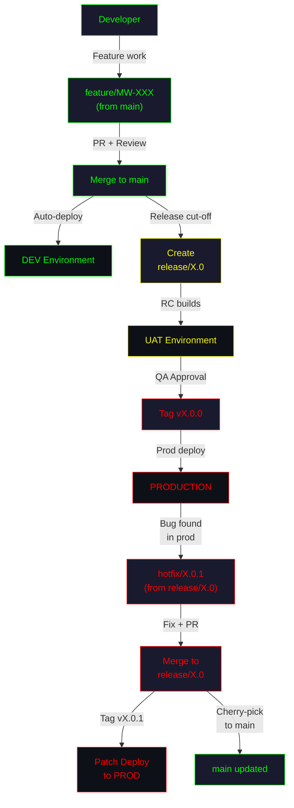
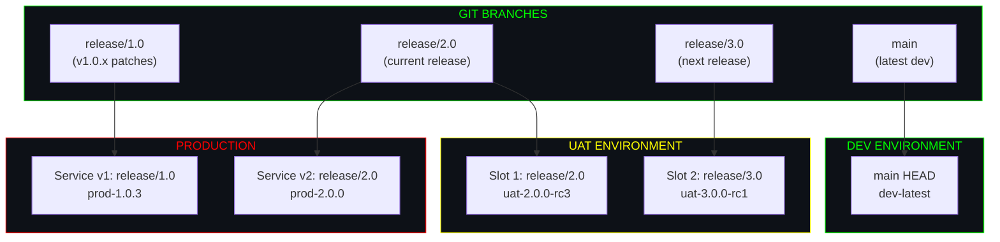
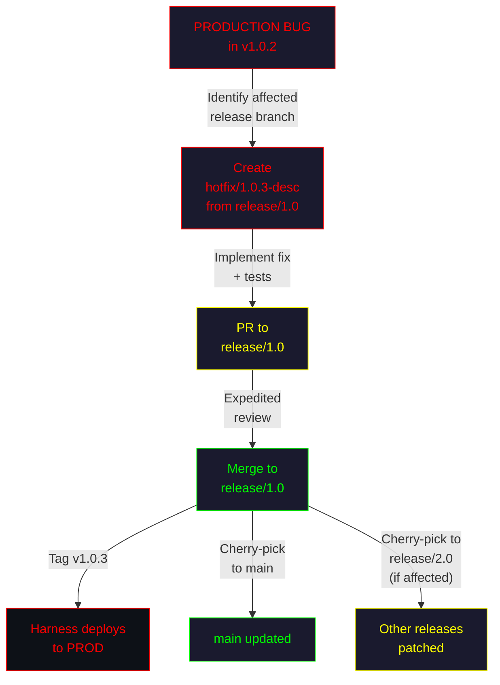
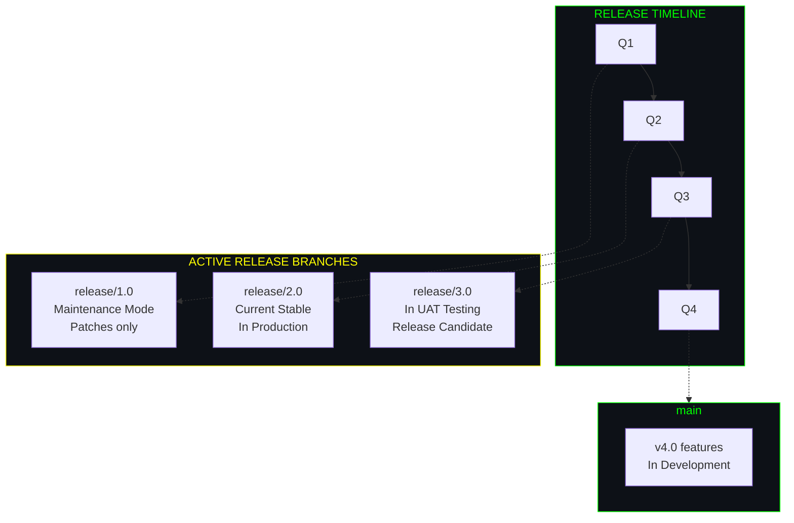
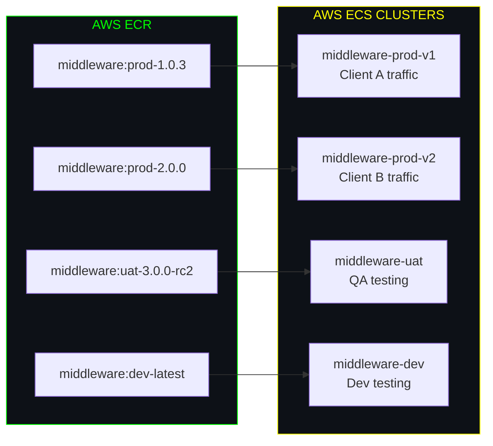
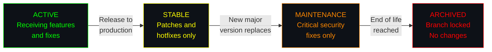

# ╔══════════════════════════════════════════════════════════════════╗
# ║        RELEASE BRANCHING STRATEGY                               ║
# ║        Java Middleware | GitHub + Harness + AWS ECS             ║
# ╚══════════════════════════════════════════════════════════════════╝

```
┌─────────────────────────────────────────────────────────────────┐
│  STRATEGY: RELEASE BRANCHING                                    │
│  ─────────────────────────────────────────────────────────────  │
│  Philosophy: Dedicated branches per release for parallel        │
│  version management. Optimized for teams shipping multiple      │
│  versions simultaneously to different clients or environments.  │
│  Core Branch: main (latest stable)                              │
│  Release Branches: release/* (long-lived, per version)          │
│  Deployment: Per-branch, per-environment pipelines.             │
└─────────────────────────────────────────────────────────────────┘
```

---

## Table of Contents

- [Branch Structure](#branch-structure)
- [Visual Flow Diagram](#visual-flow-diagram)
- [Workflow Steps](#workflow-steps)
- [Environment Mapping](#environment-mapping)
- [Harness Pipeline Configuration](#harness-pipeline-configuration)
- [Hotfix Protocol](#hotfix-protocol)
- [Simultaneous Releases](#simultaneous-releases)
- [Version Management](#version-management)
- [Pros and Cons](#pros-and-cons)

---

## Branch Structure

```
┌─────────────────────────────────────────────────────────────────┐
│  BRANCH TOPOLOGY                                                │
│  ─────────────────────────────────────────────────────────────  │
│                                                                 │
│  main ────●────●────●────●────●────●────●─────────────►        │
│            \        \        \                                   │
│  release/   \        \        \                                 │
│   1.0.x ─────●──●──●──●──●───────────────────────────►        │
│               \                                                 │
│   2.0.x ───────────●──●──●──●──●──●──────────────────►        │
│                          \                                      │
│   3.0.x ─────────────────────●──●──●──●──────────────►        │
│                                                                 │
│  feature/                                                       │
│   MW-XXX ──●──●  (branch from main or release/*)               │
│                                                                 │
│  hotfix/                                                        │
│   X.Y.Z ──●  (branch from release/*, merge back)              │
│                                                                 │
└─────────────────────────────────────────────────────────────────┘
```

**Key characteristics:**
- **`main`** contains the latest development work (similar to `develop` in GitFlow).
- **`release/*`** branches are **long-lived** — they persist for the lifetime of that release version.
- Each release branch can receive **independent patches and hotfixes**.
- Multiple release branches can be **active simultaneously**.

---

## Visual Flow Diagram

### Release Lifecycle

```mermaid
gitgraph
    commit id: "init"
    commit id: "feat-A"
    commit id: "feat-B"
    branch release/1.0
    commit id: "1.0.0-rc1" tag: "v1.0.0-rc1"
    checkout main
    commit id: "feat-C"
    commit id: "feat-D"
    checkout release/1.0
    commit id: "fix-1.0-bug"
    commit id: "1.0.0" tag: "v1.0.0"
    checkout main
    commit id: "feat-E"
    branch release/2.0
    commit id: "2.0.0-rc1" tag: "v2.0.0-rc1"
    checkout release/1.0
    commit id: "1.0.1-patch" tag: "v1.0.1"
    checkout release/2.0
    commit id: "fix-2.0-bug"
    commit id: "2.0.0" tag: "v2.0.0"
    checkout main
    commit id: "feat-F"
```

### Full Deployment Flow



---

## Workflow Steps

### Phase 1 — Feature Development on Main

```bash
# Start from main
git checkout main
git pull origin main

# Create feature branch
git checkout -b feature/MW-200-add-rate-limiter

# Develop and test
mvn clean verify

# Commit and push
git add src/
git commit -m "feat(MW-200): add rate limiter middleware"
git push origin feature/MW-200-add-rate-limiter
```

Open a **Pull Request** targeting `main`. After review and CI, merge.

### Phase 2 — Create a Release Branch

When a set of features is ready for release:

```bash
# Create release branch from main
git checkout main
git pull origin main
git checkout -b release/2.0

# Set the version
mvn versions:set -DnewVersion=2.0.0-SNAPSHOT
git add pom.xml
git commit -m "chore: initialize release/2.0 branch"
git push origin release/2.0
```

### Phase 3 — Release Candidate Cycle

```bash
# On the release branch, create release candidates
git checkout release/2.0

# Fix issues found in UAT
git checkout -b bugfix/MW-210-fix-validation
# ... fix and test ...
git commit -m "fix(MW-210): correct input validation for rate limiter"
git push origin bugfix/MW-210-fix-validation
# PR to release/2.0
```

After each fix, Harness builds a new RC and deploys to UAT:

```bash
# Tag release candidates
git tag -a v2.0.0-rc1 -m "Release candidate 1"
git push origin v2.0.0-rc1
```

### Phase 4 — Release to Production

After QA sign-off:

```bash
# Finalize version
git checkout release/2.0
mvn versions:set -DnewVersion=2.0.0
git add pom.xml
git commit -m "chore: set final version 2.0.0"

# Tag the release
git tag -a v2.0.0 -m "Release 2.0.0"
git push origin release/2.0 --tags
```

Harness triggers production deployment on the version tag.

### Phase 5 — Forward-Port Fixes to Main

```bash
# Cherry-pick release fixes back to main
git checkout main
git cherry-pick <commit-hash-of-fix>
git push origin main
```

**Important:** Always forward-port fixes from release branches to `main` to prevent regressions.

---

## Environment Mapping



| Branch          | Deploys To      | ECR Tag Pattern         | Trigger                         |
|-----------------|-----------------|-------------------------|---------------------------------|
| `main`          | **Dev**         | `dev-latest`            | Auto on merge to main           |
| `release/X.0`   | **UAT**        | `uat-X.0.0-rc{n}`      | Auto on push to release/*       |
| `release/X.0`   | **Prod**       | `prod-X.0.{patch}`     | Version tag push (vX.Y.Z)      |
| `hotfix/X.Y.Z` | **Dev → Prod**  | `hotfix-X.Y.Z`         | Auto on push to hotfix/*        |

---

## Harness Pipeline Configuration

```
┌─────────────────────────────────────────────────────────────────┐
│  PIPELINE 1: middleware-main-deploy                             │
│  ─────────────────────────────────────────────────────────────  │
│  Trigger: Push to main                                         │
│  Target: DEV                                                   │
│  Stages: Build → Test → Docker(dev-latest) → Deploy-Dev        │
├─────────────────────────────────────────────────────────────────┤
│  PIPELINE 2: middleware-release-rc                              │
│  ─────────────────────────────────────────────────────────────  │
│  Trigger: Push to release/* (non-tag)                          │
│  Target: UAT                                                   │
│  Stages: Build → Test → Docker(uat-rc) → Deploy-UAT            │
├─────────────────────────────────────────────────────────────────┤
│  PIPELINE 3: middleware-release-prod                            │
│  ─────────────────────────────────────────────────────────────  │
│  Trigger: Tag push (v*) on release/*                           │
│  Target: PROD                                                  │
│  Stages: Build → Test → Docker(prod) → Approval → Deploy-Prod  │
├─────────────────────────────────────────────────────────────────┤
│  PIPELINE 4: middleware-hotfix                                  │
│  ─────────────────────────────────────────────────────────────  │
│  Trigger: Push to hotfix/*                                     │
│  Target: DEV (auto) + PROD (with approval)                     │
│  Stages: Build → Test → Docker → Deploy-Dev → Gate → Deploy-Prod│
└─────────────────────────────────────────────────────────────────┘
```

---

## Hotfix Protocol

Hotfixes target specific release branches, not `main`:



### Hotfix Steps

1. **Identify the affected release branch:**
   ```bash
   # Which version is in production?
   git tag --list 'v1.0.*' --sort=-version:refname | head -1
   # Output: v1.0.2 → release branch is release/1.0
   ```

2. **Create hotfix branch from the release branch:**
   ```bash
   git checkout release/1.0
   git pull origin release/1.0
   git checkout -b hotfix/1.0.3-fix-connection-pool
   ```

3. **Implement and verify:**
   ```bash
   # Fix the bug
   mvn clean verify

   # Commit
   git add src/
   git commit -m "fix: resolve connection pool exhaustion under load"
   git push origin hotfix/1.0.3-fix-connection-pool
   ```

4. **Open PR to `release/1.0`** (not to main):
   - Expedited review (1 senior reviewer minimum).
   - CI must pass.

5. **Merge and tag:**
   ```bash
   git checkout release/1.0
   git merge --no-ff hotfix/1.0.3-fix-connection-pool
   git tag -a v1.0.3 -m "Hotfix 1.0.3: fix connection pool exhaustion"
   git push origin release/1.0 --tags
   ```

6. **Forward-port the fix:**
   ```bash
   # Cherry-pick to main
   git checkout main
   git cherry-pick <commit-hash>
   git push origin main

   # Cherry-pick to other active release branches if affected
   git checkout release/2.0
   git cherry-pick <commit-hash>
   git push origin release/2.0
   ```

7. **Clean up:**
   ```bash
   git branch -d hotfix/1.0.3-fix-connection-pool
   git push origin --delete hotfix/1.0.3-fix-connection-pool
   ```

### Multi-Version Hotfix Matrix

When a bug affects multiple release versions:

```
┌─────────────────────────────────────────────────────────────────┐
│  HOTFIX PROPAGATION MATRIX                                      │
│  ─────────────────────────────────────────────────────────────  │
│                                                                 │
│  Bug Found In: release/1.0 (v1.0.2 in PROD)                   │
│                                                                 │
│  Also Affected:                                                │
│    release/2.0 ──► Cherry-pick fix → tag v2.0.1               │
│    release/3.0 ──► Cherry-pick fix → tag v3.0.1               │
│    main        ──► Cherry-pick fix (for future releases)       │
│                                                                 │
│  ORDER: Fix oldest affected branch first, then forward-port.   │
│                                                                 │
└─────────────────────────────────────────────────────────────────┘
```

---

## Simultaneous Releases

This is the **core strength** of Release Branching. Multiple versions coexist naturally.

### Scenario: Three Active Versions



### Parallel Release Management

```
┌─────────────────────────────────────────────────────────────────┐
│  PARALLEL RELEASE MANAGEMENT                                    │
│  ─────────────────────────────────────────────────────────────  │
│                                                                 │
│  release/1.0 ──► PROD (Client A)   │ Patches: 1.0.1, 1.0.2   │
│  release/2.0 ──► PROD (Client B)   │ Current stable           │
│  release/3.0 ──► UAT (Testing)     │ Next release             │
│  main        ──► DEV (Development) │ Future features (v4.0)   │
│                                                                 │
│  RULES:                                                        │
│  ─────                                                         │
│  1. Fixes flow FORWARD: 1.0 → 2.0 → 3.0 → main               │
│  2. Features never flow BACKWARD: main → release/* is banned   │
│  3. Each release branch has its own Harness pipeline config    │
│  4. ECR tags include the release version for traceability      │
│                                                                 │
└─────────────────────────────────────────────────────────────────┘
```

### ECS Service Mapping for Multiple Versions



---

## Version Management

### Semantic Versioning

```
┌─────────────────────────────────────────────────────────────────┐
│  VERSION FORMAT: MAJOR.MINOR.PATCH                              │
│  ─────────────────────────────────────────────────────────────  │
│                                                                 │
│  MAJOR (X.0.0) ──► Breaking API changes                       │
│                     New release branch: release/X.0             │
│                                                                 │
│  MINOR (X.Y.0) ──► New features, backward compatible          │
│                     Tag on release branch: vX.Y.0              │
│                                                                 │
│  PATCH (X.Y.Z) ──► Bug fixes, hotfixes                        │
│                     Tag on release branch: vX.Y.Z              │
│                                                                 │
└─────────────────────────────────────────────────────────────────┘
```

### Maven Version Management

```bash
# On release branch — set release version
mvn versions:set -DnewVersion=2.0.0

# After release — set next snapshot on main
mvn versions:set -DnewVersion=3.0.0-SNAPSHOT

# For patches on release branch
mvn versions:set -DnewVersion=2.0.1
```

### Release Branch Lifecycle



| Phase          | Allowed Changes              | Duration      |
|----------------|------------------------------|---------------|
| **Active**     | Features, bug fixes          | Until release |
| **Stable**     | Bug fixes, patches           | 6-12 months   |
| **Maintenance**| Critical/security fixes only | 6 months      |
| **Archived**   | No changes (branch locked)   | Indefinite    |

---

## Pros and Cons

```
┌─────────────────────────────────────────────────────────────────┐
│  RELEASE BRANCHING — PROS & CONS                                │
├─────────────────────────────┬───────────────────────────────────┤
│  ADVANTAGES                 │  DISADVANTAGES                    │
├─────────────────────────────┼───────────────────────────────────┤
│  Native parallel releases   │  Branch proliferation over time  │
│  Independent patch cycles   │  Cherry-pick overhead            │
│  Clear version isolation    │  Divergence between branches     │
│  Client-specific versions   │  Multiple pipeline configs       │
│  Simple to understand       │  Testing matrix grows quickly    │
│  Flexible EOL management    │  Higher infra cost (multi-env)   │
│  Strong audit trail         │  Requires discipline in fwd-port │
│  Easy rollback per version  │  More complex ECR/ECS management │
└─────────────────────────────┴───────────────────────────────────┘
```

| Factor                 | Rating     | Notes                                               |
|------------------------|------------|-----------------------------------------------------|
| Setup Complexity       | **Medium** | One-time pipeline per release branch                |
| Day-to-Day Complexity  | **Medium** | Developers mostly work on main                      |
| CI/CD Requirements     | **High**   | Per-branch pipelines, multiple deploy targets       |
| Team Discipline Needed | **High**   | Must consistently forward-port fixes                |
| Concurrent Releases    | **Native** | Core design — multiple versions coexist             |
| Hotfix Speed           | **Fast**   | Direct to affected release branch                   |
| Audit Trail            | **Strong** | Per-version history, clear tag trail                |

---

## When to Use Release Branching

**Choose this strategy when:**
- You support **multiple production versions** simultaneously (e.g., different clients on different versions).
- Your middleware has **API versioning** requirements (v1, v2, v3 coexist).
- Clients have **different upgrade schedules** and can't all be on the latest version.
- You need **independent patch cycles** per version.
- Your team practices **semantic versioning** rigorously.

**Avoid this strategy when:**
- You only have **one production version** at any time.
- You deploy **continuously** and don't maintain older versions.
- Your team is **small** and maintaining multiple branches is overhead.
- You don't have the **infrastructure** to run multiple production environments.

---

## Release Branching vs. GitFlow

```
┌─────────────────────────────────────────────────────────────────┐
│  KEY DIFFERENCE                                                 │
│  ─────────────────────────────────────────────────────────────  │
│                                                                 │
│  GitFlow:                                                      │
│    release/* branches are SHORT-LIVED                          │
│    They exist only during the release stabilization window     │
│    After merge to main, the release branch is DELETED          │
│                                                                 │
│  Release Branching:                                            │
│    release/* branches are LONG-LIVED                           │
│    They persist for the lifetime of that version               │
│    They receive patches independently of main                  │
│    Multiple release branches coexist in production             │
│                                                                 │
└─────────────────────────────────────────────────────────────────┘
```

---

```
╔══════════════════════════════════════════════════════════════════╗
║  END OF RELEASE BRANCHING GUIDE                                  ║
║  ← Back to README.md for strategy comparison                     ║
╚══════════════════════════════════════════════════════════════════╝
```
