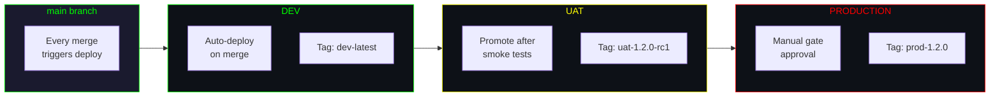
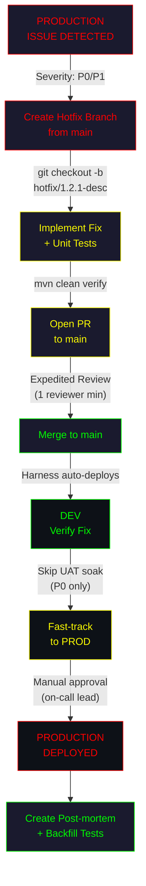
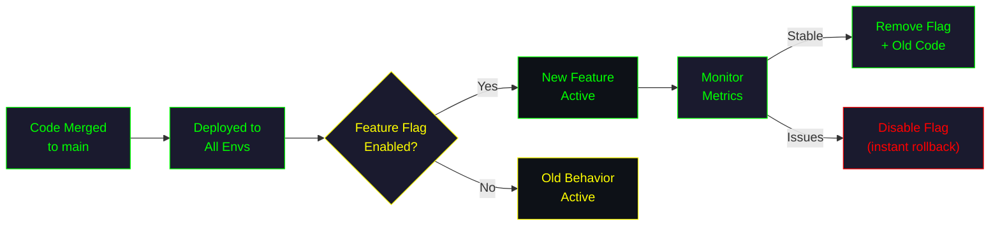

# ╔══════════════════════════════════════════════════════════════════╗
# ║        TRUNK-BASED DEVELOPMENT                                  ║
# ║        Java Middleware | GitHub + Harness + AWS ECS             ║
# ╚══════════════════════════════════════════════════════════════════╝

```
┌─────────────────────────────────────────────────────────────────┐
│  STRATEGY: TRUNK-BASED DEVELOPMENT                              │
│  ─────────────────────────────────────────────────────────────  │
│  Philosophy: Small, frequent commits directly to main.          │
│  Core Branch: main (single source of truth)                     │
│  Short-lived feature branches: max 1-2 days                     │
│  Deployment: Continuous — every merge triggers the pipeline.    │
└─────────────────────────────────────────────────────────────────┘
```

---

## Table of Contents

- [Branch Structure](#branch-structure)
- [Visual Flow Diagram](#visual-flow-diagram)
- [Workflow Steps](#workflow-steps)
- [Environment Mapping](#environment-mapping)
- [Harness Pipeline Configuration](#harness-pipeline-configuration)
- [Hotfix Protocol](#hotfix-protocol)
- [Simultaneous Releases](#simultaneous-releases)
- [Feature Flags](#feature-flags)
- [Pros and Cons](#pros-and-cons)

---

## Branch Structure

```
┌─────────────────────────────────────────────────────────────────┐
│  BRANCH TOPOLOGY                                                │
│  ─────────────────────────────────────────────────────────────  │
│                                                                 │
│  main ─────●────●────●────●────●────●────●────►                │
│             \  /      \  /      \  /                            │
│  feature/    ●         ●         ●     (short-lived, < 2 days) │
│                                                                 │
│  hotfix/                    ●──●  (branch + merge same day)    │
│                                                                 │
└─────────────────────────────────────────────────────────────────┘
```

**Key principle:** `main` is always deployable. Every commit on `main` is a release candidate.

---

## Visual Flow Diagram

### Developer to Production

```mermaid
flowchart TD
    A["Developer\nLocal Machine"] -->|git checkout -b\nfeature/MW-123-desc| B["Feature Branch\n(short-lived)"]
    B -->|"mvn clean verify\n(local tests)"| C["Local Tests Pass"]
    C -->|git push origin\nfeature/MW-123-desc| D["GitHub\nPull Request"]
    D -->|"Code Review\n+ CI Checks"| E{"PR Approved?"}
    E -->|No| F["Address\nFeedback"]
    F --> D
    E -->|Yes| G["Squash Merge\ninto main"]
    G -->|Webhook triggers| H["Harness Pipeline"]
    H -->|"mvn clean package"| I["Build .jar\nArtifact"]
    I -->|"docker build\n+ push"| J["AWS ECR\ndev-latest"]
    J -->|"ecs deploy"| K["DEV\nECS Service"]
    K -->|"Smoke tests\npass"| L["Promote to\nUAT"]
    L -->|"ecs deploy\nuat-{version}"| M["UAT\nECS Service"]
    M -->|"QA Sign-off\n+ Manual Gate"| N["Promote to\nPROD"]
    N -->|"ecs deploy\nprod-{version}"| O["PRODUCTION\nECS Service"]

    style A fill:#1a1a2e,stroke:#0f0,color:#0f0
    style B fill:#1a1a2e,stroke:#0f0,color:#0f0
    style C fill:#1a1a2e,stroke:#0f0,color:#0f0
    style D fill:#1a1a2e,stroke:#0f0,color:#0f0
    style E fill:#1a1a2e,stroke:#ff0,color:#ff0
    style F fill:#1a1a2e,stroke:#f00,color:#f00
    style G fill:#1a1a2e,stroke:#0f0,color:#0f0
    style H fill:#1a1a2e,stroke:#0f0,color:#0f0
    style I fill:#1a1a2e,stroke:#0f0,color:#0f0
    style J fill:#1a1a2e,stroke:#0f0,color:#0f0
    style K fill:#0d1117,stroke:#0f0,color:#0f0
    style L fill:#0d1117,stroke:#ff0,color:#ff0
    style M fill:#0d1117,stroke:#ff0,color:#ff0
    style N fill:#0d1117,stroke:#f00,color:#f00
    style O fill:#0d1117,stroke:#f00,color:#f00
```



### Branch Lifecycle

```mermaid
gitgraph
    commit id: "v1.0.0"
    commit id: "config-update"
    branch feature/MW-101-auth
    commit id: "add-auth-filter"
    commit id: "add-auth-tests"
    checkout main
    merge feature/MW-101-auth id: "merge-MW-101" type: HIGHLIGHT
    commit id: "v1.1.0" tag: "v1.1.0"
    branch feature/MW-102-cache
    commit id: "add-redis-cache"
    checkout main
    merge feature/MW-102-cache id: "merge-MW-102" type: HIGHLIGHT
    commit id: "v1.2.0" tag: "v1.2.0"
    branch hotfix/1.2.1-npe
    commit id: "fix-null-pointer"
    checkout main
    merge hotfix/1.2.1-npe id: "merge-hotfix" type: REVERSE
    commit id: "v1.2.1" tag: "v1.2.1"
```

---

## Workflow Steps

### Step 1 — Start a Feature

```bash
# Pull latest main
git checkout main
git pull origin main

# Create short-lived feature branch
git checkout -b feature/MW-123-add-retry-logic
```

### Step 2 — Develop and Test Locally

```bash
# Write code, then run local verification
mvn clean verify

# Run integration tests if applicable
mvn verify -Pintegration-tests
```

### Step 3 — Push and Open PR

```bash
# Stage only relevant files
git add src/main/java/com/middleware/retry/
git add src/test/java/com/middleware/retry/

# Commit with conventional message
git commit -m "feat(MW-123): add exponential retry logic for downstream calls"

# Push feature branch
git push origin feature/MW-123-add-retry-logic
```

Open a **Pull Request** on GitHub targeting `main`.

### Step 4 — Code Review and CI

- Harness runs the **PR validation pipeline** automatically.
- Pipeline executes: **compile → unit tests → integration tests → static analysis**.
- Minimum **1 approval** required before merge.
- All CI checks must pass (green).

### Step 5 — Merge to Main

- Use **Squash and Merge** to keep `main` history clean.
- Delete the feature branch after merge.
- Harness triggers the **deployment pipeline** on the new `main` commit.

### Step 6 — Automated Deployment to Dev

- Harness builds the Docker image: **`docker build -t middleware:dev-latest .`**
- Pushes to ECR: **`aws ecr ... middleware:dev-latest`**
- Deploys to ECS Dev cluster.
- Runs automated smoke tests.

### Step 7 — Promote Through Environments

- **Dev → UAT:** Triggered after Dev smoke tests pass. Image re-tagged as `uat-{version}`.
- **UAT → Prod:** Requires **manual approval gate** in Harness after QA sign-off.

---

## Environment Mapping



| Trigger                          | Target Environment | Image Tag             |
|----------------------------------|--------------------|-----------------------|
| Merge to `main`                  | Dev                | `dev-latest`          |
| Dev smoke tests pass             | UAT                | `uat-{ver}-rc{n}`     |
| Manual approval in Harness       | Production         | `prod-{ver}`          |

---

## Harness Pipeline Configuration

```
┌─────────────────────────────────────────────────────────────────┐
│  PIPELINE: middleware-trunk-deploy                              │
│  ─────────────────────────────────────────────────────────────  │
│                                                                 │
│  Trigger: Push to main                                         │
│                                                                 │
│  Stage 1: BUILD                                                │
│    ├── mvn clean package -DskipTests=false                     │
│    ├── mvn verify                                              │
│    └── Archive: target/middleware-*.jar                         │
│                                                                 │
│  Stage 2: DOCKER                                               │
│    ├── docker build -t {ECR_REPO}:dev-latest .                 │
│    └── docker push {ECR_REPO}:dev-latest                       │
│                                                                 │
│  Stage 3: DEPLOY-DEV                                           │
│    ├── ecs update-service --cluster dev --service middleware    │
│    └── Wait for steady state                                   │
│                                                                 │
│  Stage 4: SMOKE-TEST                                           │
│    └── Run /health and /readiness checks                       │
│                                                                 │
│  Stage 5: DEPLOY-UAT (auto on smoke pass)                      │
│    ├── Re-tag image: uat-{version}-rc{n}                       │
│    ├── ecs update-service --cluster uat --service middleware    │
│    └── Notify QA team                                          │
│                                                                 │
│  Stage 6: DEPLOY-PROD (manual approval gate)                   │
│    ├── Re-tag image: prod-{version}                            │
│    ├── ecs update-service --cluster prod --service middleware   │
│    └── Post-deploy verification                                │
│                                                                 │
└─────────────────────────────────────────────────────────────────┘
```

---

## Hotfix Protocol

When production has a critical bug that cannot wait for the normal flow:



### Hotfix Steps

1. **Create hotfix branch** from the latest `main`:
   ```bash
   git checkout main && git pull origin main
   git checkout -b hotfix/1.2.1-fix-null-pointer
   ```

2. **Implement the fix** with corresponding unit tests.

3. **Run local verification:**
   ```bash
   mvn clean verify
   ```

4. **Open PR** targeting `main` with the label `hotfix` and priority `P0` or `P1`.

5. **Expedited review:** Minimum 1 senior reviewer. CI must still pass.

6. **Merge to main.** Harness deploys to Dev automatically.

7. **Fast-track promotion:** For P0 issues, the on-call lead can approve skipping the UAT soak period and deploy directly to Prod via Harness manual gate.

8. **Post-incident:** Create a post-mortem document. Backfill any missing test coverage.

---

## Simultaneous Releases

Trunk-Based Development has **limited native support** for concurrent releases. Use these techniques:

### Feature Flags

```java
// Use a feature flag service (e.g., LaunchDarkly, Harness FF)
if (featureFlagService.isEnabled("MW-200-new-routing-engine", context)) {
    return newRoutingEngine.route(request);
} else {
    return legacyRouter.route(request);
}
```

- Deploy code for multiple features to `main` simultaneously.
- Toggle features on/off per environment without branching.
- Gradually roll out to percentages of traffic in Prod.

### Release Tags

When you need a specific point-in-time release:

```bash
# Tag the commit you want to release
git tag -a v1.3.0 -m "Release 1.3.0: new routing engine"
git push origin v1.3.0
```

Harness can be configured to trigger a **release pipeline** on tag push, building and deploying that exact commit.

### Environment Pinning

If UAT needs to stay on v1.2.0 while Dev moves to v1.3.0-SNAPSHOT:

```
┌─────────────────────────────────────────────────────────────────┐
│  ENVIRONMENT PINNING                                            │
│  ─────────────────────────────────────────────────────────────  │
│                                                                 │
│  DEV  ──► main HEAD (latest)          Tag: dev-latest          │
│  UAT  ──► Pinned to v1.2.0 commit    Tag: uat-1.2.0-rc3       │
│  PROD ──► Pinned to v1.1.0 release   Tag: prod-1.1.0          │
│                                                                 │
└─────────────────────────────────────────────────────────────────┘
```

---

## Feature Flags

Feature flags are **essential** for Trunk-Based Development. They decouple deployment from release.



**Best practices:**
- Flag names should match ticket IDs: `MW-200-new-routing-engine`
- Set a **flag expiry date** (30 days after full rollout)
- Clean up old flags aggressively to avoid technical debt

---

## Pros and Cons

```
┌─────────────────────────────────────────────────────────────────┐
│  TRUNK-BASED DEVELOPMENT — PROS & CONS                          │
├─────────────────────────────┬───────────────────────────────────┤
│  ADVANTAGES                 │  DISADVANTAGES                    │
├─────────────────────────────┼───────────────────────────────────┤
│  Simple branch model        │  Requires strong CI discipline   │
│  Fast feedback loops        │  Feature flags add complexity    │
│  Minimal merge conflicts    │  Not ideal for long-lived work   │
│  Always-deployable main     │  Needs mature test coverage      │
│  Easy rollback via revert   │  Limited parallel release support│
│  Small PRs = better reviews │  Team must commit to small PRs   │
│  Lower cognitive overhead   │  Broken main blocks everyone     │
│  Natural CD alignment       │  Requires senior team discipline │
└─────────────────────────────┴───────────────────────────────────┘
```

| Factor                 | Rating   | Notes                                           |
|------------------------|----------|-------------------------------------------------|
| Setup Complexity       | **Low**  | Minimal branch rules needed                     |
| Day-to-Day Complexity  | **Low**  | One branch, simple workflow                     |
| CI/CD Requirements     | **High** | Must have robust, fast pipelines                |
| Team Discipline Needed | **High** | Small PRs, frequent integration                 |
| Concurrent Releases    | **Low**  | Relies on feature flags, not native branching   |
| Hotfix Speed           | **Fast** | Fix goes straight to main                       |
| Audit Trail            | **Good** | Linear history, tagged releases                 |

---

## When to Use Trunk-Based Development

**Choose this strategy when:**
- Your team ships **continuously** (daily or multiple times per day).
- You have **strong CI/CD pipelines** with fast, reliable tests.
- Your middleware services are **independently deployable** microservices.
- Your team is disciplined about **small, incremental changes**.

**Avoid this strategy when:**
- You need to maintain **multiple production versions** simultaneously.
- Your release cycle is **quarterly or longer**.
- Your team is **large** and coordination is difficult.
- You lack **adequate test automation**.

---

```
╔══════════════════════════════════════════════════════════════════╗
║  END OF TRUNK-BASED DEVELOPMENT GUIDE                            ║
║  ← Back to README.md for strategy comparison                     ║
╚══════════════════════════════════════════════════════════════════╝
```
